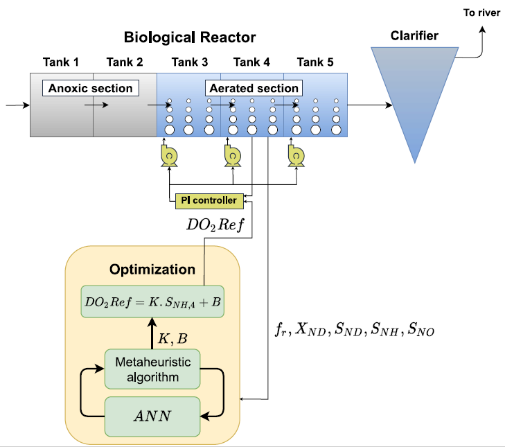
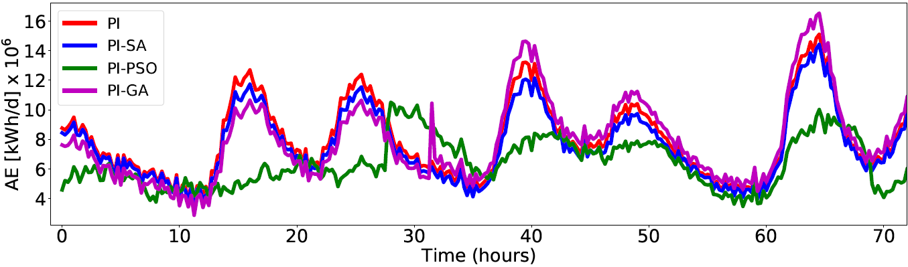

# Dynamic Setpoint Optimization Using Metaheuristic Algorithms for Wastewater Treatment Plants
Project developed with the objective of using metaheuristic algorithms to update, online, the dissolved oxygen reference values for the PI control of the biological reactor of a wastewater treatment plant.

## Table of Contents
* [General Information](#general-information)
* [Technologies Used](#technologies-used)
* [Optimization framework](#Optimization-framework)
* [Setup](#setup)
* [Usage](#usage)
* [Results](#Results)
* [Project Status](#project-status)
* [Room for Improvement](#room-for-improvement)
* [Acknowledgements](#acknowledgements)
* [Contact](#contact)
<!-- * [License](#license) -->

## General Information
* This work originated a paper that was presented at the 48th Annual Conference of the IEEE Industrial Electronics Society - [IECON 2022](https://iecon2022.org/), 17-23 October 2022 - Brussels - Belgium.
* Program developed to provide, in real time, the reference value for the PI control of the biological reactor of a wastewater treatment plant (WWTP).
* The program developed in Python optimizes the aeration system of a WWTP represented by the Benchmark Simulation Model no. 2 (BSM2).
* Metaheuristic algorithms used:
  * Genetic Algorithm (GA)
  * Particle Swarm Optimization (PSO)
  * Simulated Annealing (SA)

## Technologies Used
- Python - version 3.8.8
- Keras - version 2.6.0
- TensorFlow - version 2.6.0
- Benchmark Simulation Model no. 2 (BSM2)
- MATLAB/Simulink - version 2021a

## Optimization framework
* Proposed optimization framework

## Setup
* To run the optimization model proposed in the article, the BSM2 simulator must be installed. More information about the simulator, its installation and operation can be found here https://github.com/wwtmodels and here https://wwtmodels.pubpub.org.
* To obtain the BSM2 surrogate function, run the notebook data_AE, present in the “general” folder. By running the notebook cells in sequence an artificial neural network will be trained. You can use the model model_ann_AE3.h5 already trained, present in the same folder. This model must be added to the directory that will be opened by MATLAB/Simulink.
* With the BSM2 installed, open the Simulink model OTZ_bsm2_cl, present in the General folder.
* For each analyzed algorithm, Genetic Algorithm (GA), Particle Swarm Optimization (PSO) and Simulated Annealing (SA), there is a folder with their respective programs. All these programs must be in the same directory.
* Start the Simulink model OTZ_bsm2_cl, and then run the following programs:
   * To implement GA optimization, run: teste_GA_09_02
   * To implement SA optimization, run: annealing
   * To implement PSO optimization, run: PSO_main

## Results
Variation of aeration energy consumption in a three-day sample:

## Project Status
Project is: _in progress_ / _complete_ / _no longer being worked on_. If you are no longer working on it, provide reasons why.

## Room for Improvement
Include areas you believe need improvement / could be improved. Also add TODOs for future development.

Room for improvement:
- Improvement to be done 1
- Improvement to be done 2

To do:
- Feature to be added 1
- Feature to be added 2

## Acknowledgements
Give credit here.
- This project was inspired by...
- This project was based on [this tutorial](https://www.example.com).
- Many thanks to...

## Contact
Created by [@flynerdpl](https://www.flynerd.pl/) - feel free to contact me!

<!-- Optional -->
<!-- ## License -->
<!-- This project is open source and available under the [... License](). -->

<!-- You don't have to include all sections - just the one's relevant to your project -->
